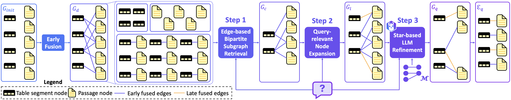

<!-- Improved compatibility of back to top link: See: https://github.com/othneildrew/Best-README-Template/pull/73 -->
<a name="readme-top"></a>
<!--
*** Thanks for checking out the Best-README-Template. If you have a suggestion
*** that would make this better, please fork the repo and create a pull request
*** or simply open an issue with the tag "enhancement".
*** Don't forget to give the project a star!
*** Thanks again! Now go create something AMAZING! :D


<!-- PROJECT SHIELDS -->
<!--
*** I'm using markdown "reference style" links for readability.
*** Reference links are enclosed in brackets [ ] instead of parentheses ( ).
*** See the bottom of this document for the declaration of the reference variables
*** for contributors-url, forks-url, etc. This is an optional, concise syntax you may use.
*** https://www.markdownguide.org/basic-syntax/#reference-style-links
-->
<!-- [![Contributors][contributors-shield]][contributors-url] -->
<!-- [![Forks][forks-shield]][forks-url] -->
<!-- [![Stargazers][stars-shield]][stars-url] -->
<!-- [![Issues][issues-shield]][issues-url] -->
<!-- [![MIT License][license-shield]][license-url] -->
<!-- [![LinkedIn][linkedin-shield]][linkedin-url] -->


<!-- PROJECT LOGO -->
<br />
<div align="center">
  <!-- <a href="https://github.com/github_username/repo_name">
    
  </a> -->

<h3 align = "center">HELIOS: Harmonizing Early Fusion, Late Fusion, and LLM Reasoning for Multi-Granular Table-Text Retrieval</h3>

  <p align = "center">
    HELIOS outperforms state-of-the-art models with a significant improvement in both recall and nDCG on the OTT-QA benchmark.
    <!-- <br />
    <a href="https://github.com/github_username/repo_name"><strong>Explore the docs »</strong></a>
    <br />
    <br />
    <a href="https://github.com/github_username/repo_name">View Demo</a>
    ·
    <a href="https://github.com/github_username/repo_name/issues">Report Bug</a>
    ·
    <a href="https://github.com/github_username/repo_name/issues">Request Feature</a> -->
  </p>
</div>


<!-- ABOUT THE PROJECT -->
## About HELIOS

We introduce HELIOS, our novel table-text retrieval model designed to enhance the capabilities of open-domain question answering systems by addressing the limitations of both early and late fusion methods. Here are the key features of HELIOS:

- Combining early and late fusion techniques, it bridges the gap between static pre-alignments and dynamic retrieval strategies, ensuring contextually relevant results for more complex queries.
- Utilizing edge-based bipartite subgraph retrieval, HELIOS materializes finer-grained relationships between table segments and text passages, reducing the inclusion of irrelevant information while maintaining crucial query-dependent links.
- Employing a query-relevant node expansion mechanism, it dynamically identifies and retrieves the most promising nodes for expansion, minimizing the risk of missing vital contexts.
- Integrating a star-based LLM refinement step, it prevents hallucinations by performing logical inference at the star graph level, enabling advanced reasoning tasks such as column-wise aggregation and multi-hop reasoning.


<p align = "center">

</p>

HELIOS outperforms state-of-the-art models with a significant improvement in both recall and nDCG on the OTT-QA benchmark.


<!-- 
### Built With

* [![Next][Next.js]][Next-url]
* [![React][React.js]][React-url]
* [![Vue][Vue.js]][Vue-url]
* [![Angular][Angular.io]][Angular-url]
* [![Svelte][Svelte.dev]][Svelte-url]
* [![Laravel][Laravel.com]][Laravel-url]
* [![Bootstrap][Bootstrap.com]][Bootstrap-url]
* [![JQuery][JQuery.com]][JQuery-url]

<p align="right">(<a href="#readme-top">back to top</a>)</p> -->

<!-- GETTING STARTED -->

## Getting Started

This page guides you to reproduce the results written in the paper "HELIOS: Harmonizing Early Fusion, Late Fusion, and LLM Reasoning for Multi-Granular Table-Text Retrieval".

Please refer to the instructions below.


### Prerequisites


You must be able to download our docker image from the docker cloud.
Please refer to [Docker Docs](https://docs.docker.com) to download docker.

### Download Docker Image

We made a docker image of our environment.
Please download from docker cloud.

1. Download our image from docker cloud
```bash
docker pull anonymous824/heliosworkspace:latest

docker pull anonymous824/heliosresources:latest
```

### Create HELIOS Workspace

Create a helios workspace using the downloaded image.

1. Docker run
```bash
docker run -itd --name acl2025-heliosworkspace anonymous824/heliosworkspace /bin/bash
```
2. Docker start
```bash
docker start acl2025-heliosworkspace
```
3. Docker init
```bash
docker init acl2025-heliosworkspace
```

### Activate Conda Env
```bash
conda activate fm
```

### Download Dataset and Model Checkpoints

1. Docker run
```bash
docker run -itd --name acl2025-heliosresources anonymous824/heliosresources /bin/bash
```
2. Docker start
```bash
docker start acl2025-heliosresources
```
3. Docker init
```bash
docker init acl2025-heliosresources
```
4. Download large language model
```bash
HF_HUB_ENABLE_HF_TRANSFER=1 huggingface-cli download meta-llama/Llama-3.1-8B-Instruct --local-dir-use-symlinks False --local-dir /mnt/sdd/OTT-QAMountSpace/ModelCheckpoints/Ours/llm/Meta-Llama-3.1-8B-Instruct --exclude *.pth
```

<!-- <p align="right">(<a href="#readme-top">back to top</a>)</p> -->

<!-- ## Download Model Checkpoints -->
<!-- edge retriever -->
<!-- edge reranker -->
<!-- table segment retriever -->
<!-- passage retriever -->
<!-- node scorer -->
<!-- LLM -->

<!-- 
## Earl Fusion -->

<!-- 

The whole reproduction process can be easily done by typing a single line

```bash
./runAll.sh
```

The anticipated runtime of the whole process is over 4 full days, so we recomment you to run the process using `tmux`!

For detailed explanation or for a more fine-grained run, jump to <a href="#quick-overview">Quick Overview</a> -->

## Build Index

1. Create edge index
```bash
sh Algorithms/Ours/scripts/build_edge_index.sh
```
2. Create table segment index
```bash
sh Algorithms/Ours/scripts/build_table_segment_index.sh
```
3. Create passage index
```bash
sh Algorithms/Ours/scripts/build_passage_index.sh
```

## Run Edge-based Bipartite Subgraph Retrieval
0. If tmux is not installed, run the following command
```bash
apt-get install tmux
```
1. Load edge retriever
```bash
tmux new -s edge_retriever
conda activate fm
cd HELIOS
sh Algorithms/Ours/scripts/load_edge_retriever.sh
```
2. Load edge reranker
```bash
tmux new -s edge_reranker
conda activate fm
cd HELIOS
sh Algorithms/Ours/scripts/load_edge_reranker.sh
```
3. Run bipartite subgraph retrieval
```bash
sh Algorithms/Ours/scripts/run_edge_based_bipartite_subgraph_retrieval.sh
```

## Run Query-relevant Node Expansion
0. Kill edge retriever session
```bash
tmux kill-session -t edge_retriever
```
1. Load seed node scorer
```bash
tmux new -s node_scorer
conda activate fm
cd HELIOS
sh Algorithms/Ours/scripts/load_seed_node_scorer.sh
```
2. Load table segment retriever
```bash
tmux new -s table_segment_retriever
conda activate fm
cd HELIOS
sh Algorithms/Ours/scripts/load_table_segment_retriever.sh
```
3. Load passage retriever
```bash
tmux new -s passage_retriever
conda activate fm
cd HELIOS
sh Algorithms/Ours/scripts/load_passage_retriever.sh
```
4. Run query-relevant node expansion
```bash
sh Algorithms/Ours/scripts/run_query_relevant_node_expansion.sh
```

## Run Star-based LLM Refinement
0. Kill edge retriever session
```bash
tmux kill-session -t edge_reranker
tmux kill-session -t node_scorer
tmux kill-session -t table_segment_retriever
tmux kill-session -t passage_retriever
```
1. Load large language model
```bash
tmux new -s llm
conda activate fm
cd HELIOS
sh Algorithms/Ours/scripts/load_llm.sh
```
2. Run star-based llm refinement
```bash
sh Algorithms/Ours/scripts/run_star_based_llm_refinement.sh
```

## Evaluate Retrieval Accuracy
0. Evaluate AnswerRecall@K
```bash
sh Algorithms/Ours/scripts/eval_answer_recall.sh
```
1. Evaluate nDCG@K
```bash
sh Algorithms/Ours/scripts/eval_ndcg.sh
```
2. Evaluate HITS@4K
```bash
sh Algorithms/Ours/scripts/eval_hits.sh
```

## Evaluate Reading Accuracy
0. Convert retrieval results into reader input
```bash
sh Algorithms/Ours/scripts/get_reader_input.sh
```
1. Evaluate Exact Match & F1 Score
```bash
sh Algorithms/Ours/scripts/eval_reading_accuracy.sh
```
<!-- CONTACT -->
